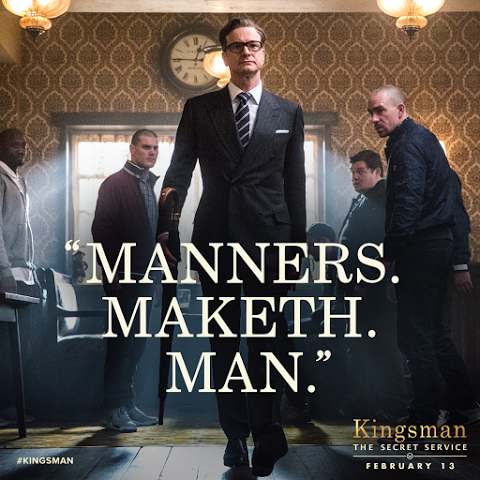

# IDE Roast!
吐槽大会 S01E01

---

### What is IDE ROAST!

- By developer, for Developer
- 团结紧张，严肃活泼

---

### IDE Roast! - S01E01

“提一个有礼貌的 MR”

---

### Bad Cases

---

> 明明可以拆成多个

https://code.byted.org/ide/gallery/merge_requests/52

---

> 没有 CR 就合并

https://code.byted.org/ide/vscode/merge_requests/197

---

> 象征性的标题

- https://code.byted.org/ide/vscode/merge_requests/180

---

> 象征性的标题（二）

https://code.byted.org/cloud-fe/ide-redirect/merge_requests/184

---

### Good Cases

---

> With docs

https://code.byted.org/ide/vscode/merge_requests/195

---

> Link to Meego

https://code.byted.org/ide/vscode/merge_requests/200

---

> A Great One

https://code.byted.org/ide/vscode/merge_requests/203

---

## Good MR

1. 拆分——每个 MR 只围绕一件事情 / 避免超大的 MR
2. 标题——概述此次 Merge Request 的目标
3. 说明——面向未来的 Reviewer，解释上下文、链接相关信息

[Merge Request 指南](https://bytedance.feishu.cn/docs/doccnKz4Xv7ObQXnMbNJDeTq60g)

---

## 约定和强制

怎样自动化、强制保障 MR 质量？

---

> desc on lines / reviewer rank / big mr rules

---

## 写一个礼貌的 MR

- 关爱 Reviewer
- 尊重 Collaborator

---

讲究的感觉

~~干活的感觉~~

---

# Manners makyth man

> 英國格言。十四世紀一位英國大臣從拉丁格言翻譯過來的，makyth即是makes，這句格言的意思是一個人的儀態，決定了他是否值得尊敬；人是由他的行為來組成的。

---

---

Thanks