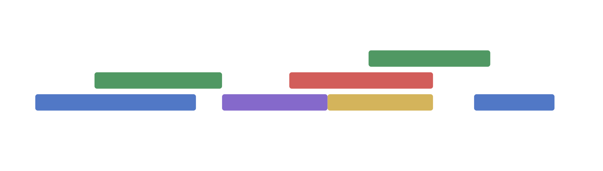
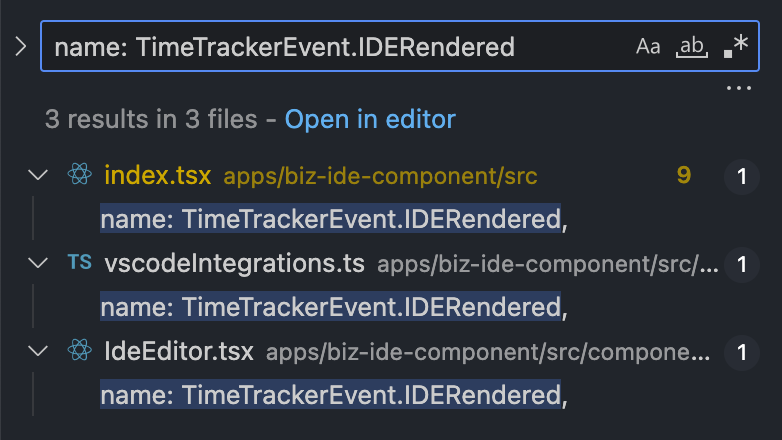
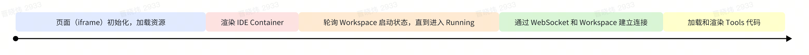
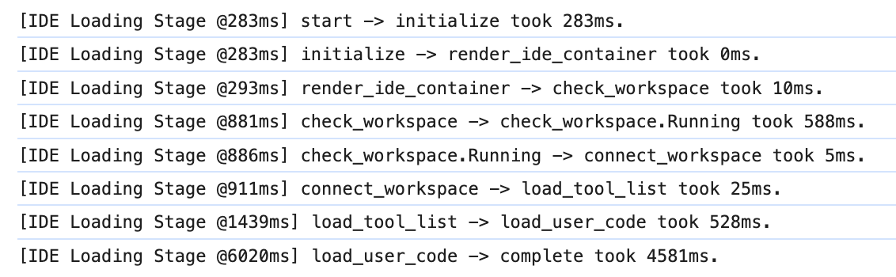

# RUM: Performance

> AKA: E2E Performance Monitoring

---

## Problem 1

---

### 2 Kinds of Performance Monitoring

- **技术指标**（针对具体操作的性能打点）
  - 如：Workspace 创建耗时、IDE Element 初始化耗时、网络延迟

- **用户体感指标**（用户使用产品的感受统计）
  - 如：从页面打开到功能可用耗时、点击响应耗时

---

**Technical Metrics** and
**User Experience Metrics**

**TM** 和 **UEM**

---

### 

用户体感指标用于**统计和发现**真实用户体验问题，然后找到关键的瓶颈点进行**有针对性的优化**。

---

### Measure the Action

- 优化的动作首先会体现在**技术指标**提升（任务完成），
- 最终应该反应在**用户体感指标**的改善上（实现目标）。

---

### 技术指标比较完善了

创建池化命中率、启动池化命中率、工作区启动耗时、TCP 连接数……

---

### 真实用户体感？

> 总共耗时多久能进入到实际可用状态？  
> 在哪个环节/状态卡的时间最长？  
> 预加载用户和非预加载用户的体验区别大么？

---

## Problem 2

---

### TimeTracker

```js
startTimeTracker(eventName)
//...
endTimeTracker(eventName)
```

---

“没有明显问题”

---

#### Issue：重叠和缺漏



---

### Issue：维护成本



两个分支？Try-Catch？Bug？

---

> it doesn't scale.

---

### A better "TimeTracker" is needed.

- 统计用户真实体验到的界面响应事件
- 不重不漏地覆盖完整加载过程
- 代码更简单，更易维护

---

## Loading Stages

Measure the **UX of Loading Performance**

---

### Loading Stages



---

### The API

```js
setLoadingStage(stageName)
```

---

`stageName`

"就在刚刚，状态变化为……"

---

a simplified demo

`start` -> `init` -> `load-user-code` -> `complete`

---

a real-world example


---

the actual logs



---

#### now

## Byte Style Data Analysis

~~Problem 3~~

---

**[Slardar Web](https://slardar.bytedance.net/node/web)**

Google Analytics, the ByteDance style.

---

### Slardar Tips

- Good Part: 数据收集、基础性能指标、实时查询分析、报警
- Bad Part: 任何数据超过三天的查询分析

---

**[Aeolus 风神](https://data.bytedance.net/aeolus)**

Tableau, the ByteDance style.

---

“三天以内 Slardar，三天以上 Aeolus”

---

Slardar -> Aeolus

---

<iframe src="https://data.bytedance.net/aeolus#/external/dashboard/848108/7447987?inline=true&appId=1006544&sheetId=962566&feature=%7B%22dashboard%22%3A%7B%22report%22%3A%7B%22showTitle%22%3Atrue%2C%22showTips%22%3Afalse%2C%22showToolbar%22%3Afalse%2C%22showHeader%22%3Atrue%7D%7D%7D" />

---

## Follow-up Tasks

- 看板搭建
- 数据校准
- 监控报警
- 分析、归因、改进

---

# Thanks