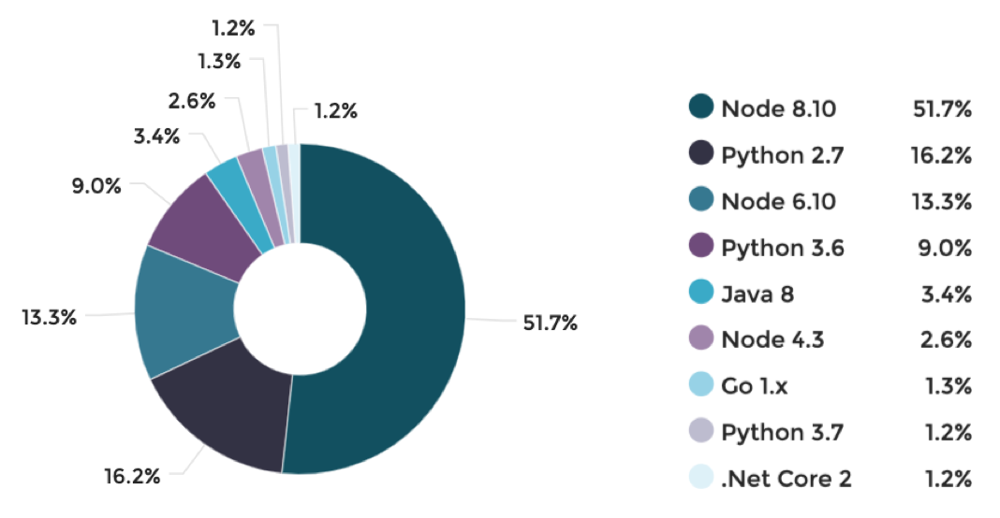
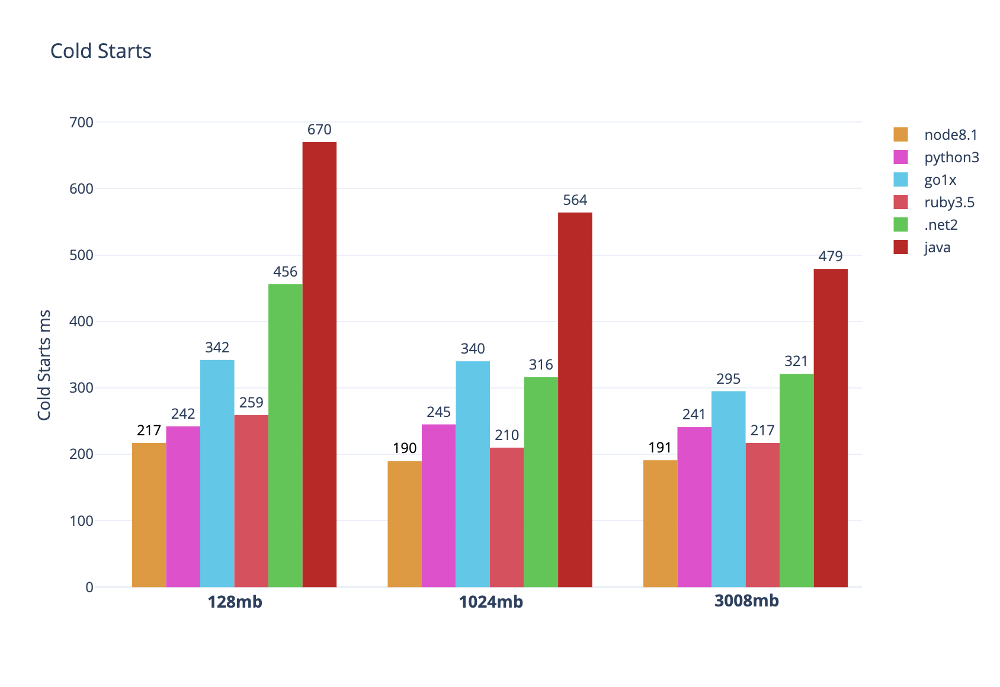

# SERVERLESS <br/> PART II

---

## bytefaas / 轻服务

---

## runkit.com

> Test with RunKit

---

### timeout

https://runkit.com/amio/timeout

---

### GitHub Repo Language Stats
https://runkit.com/amio/5b5dbbc5e7c19a0012215f38

---

### Domins Noti

https://runkit.com/amio/592e305cd344c30012a7468f

---

### Lorem Ipsum

https://runkit.com/amio/59376a8e551d0a0012ffc412

---

## webtask.io

- cron job
- storage

---

- 1 request per second soft limit
- 30 second execution limit
- 10 CRON Schedules
- 100 kb of code per task (not including npm modules)
- 400 kb of storage via the Storage API

---

## ★ GitHub Actions ★

> ... automate all your software workflows, with world-class CI/CD. Build, test, and deploy your code right from GitHub.

https://github.com/features/actions

---

### Types of Actions

- Docker container (env: `Linux`)
- JavaScript (env: `Linux`, `MacOS`, `Windows`)

---

> Docker container actions are slower than JavaScript actions.


[/about-actions](https://help.github.com/en/actions/automating-your-workflow-with-github-actions/about-actions#types-of-actions)

---

## 一等公民

---

## cron

https://github.com/amio/cron

---

## now.sh

```
npm i -g now
```

---

### Now

Start with statics.

---

## Ideas

- https://breathe.now.sh
- https://math.now.sh
- https://packagephobia.now.sh
- https://simpleicons.now.sh
- https://carbon.now.sh
- https://github-contributions.now.sh

---

## Serverless ♥️ Node.js

---



> [aws lambda rumtimes](https://thenewstack.io/what-aws-lambdas-performance-stats-reveal/)

---



> [aws lambda langs codestart](https://levelup.gitconnected.com/aws-lambda-cold-start-language-comparisons-2019-edition-%EF%B8%8F-1946d32a0244)

<style>
.slide img { max-height: 700px; margin-bottom: -3em }
</style>

---

JAM Stack

https://jamstack.org/

---

Case Study

https://vscode.rocks/vscode-issue-tracker/
